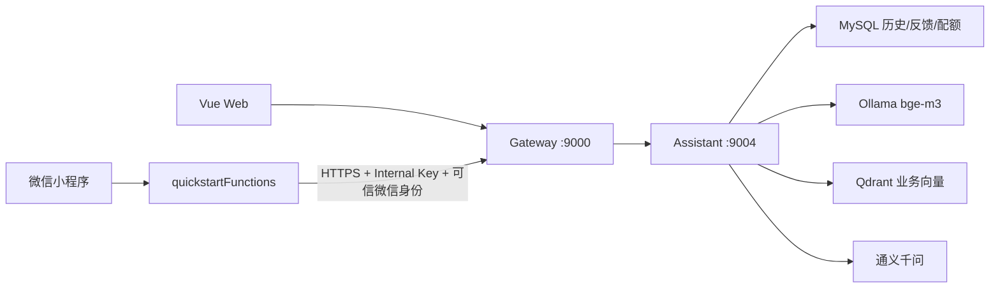

# 航翼 Agent + RAG 双端落地计划

| 项目 | 当前结论 |
|---|---|
| 文档版本 | v3.1，2026-08-01 |
| 涉及项目 | 微信小程序 `hangyi/` + Java `ideaprojects/hangyi/` |
| 当前阶段 | P0 到 P3 已完成代码实现；本地业务问答 30/30 通过，等待云环境部署和真实知识验收 |
| 服务端口 | Gateway 9000，Assistant 9004 |
| 首版模式 | `KNOWLEDGE_ONLY` |

## 1. 已完成能力

### P0 安全基建

- Java 新增独立 `hangyi-assistant` 模块，Gateway 路由为 `/api/assistant/**`。
- Web 入口在助手服务再次验证 JWT 和 Redis 撤销状态。
- 小程序只调用云函数；云函数使用内部密钥，并从当前 OPENID 绑定人员生成工号、姓名和管理员状态。
- 小程序云函数只允许访问证书有效的公网 HTTPS Gateway origin。
- 密钥、Qdrant 和模型地址只通过服务端环境变量和云数据库配置管理。

### P1 知识入库

- 数据源限定为员工真正需要的业务 Markdown/TXT，不把 Java、WXML、WXSS 源码混入员工知识库。
- 内置 6 份业务知识：角色权限、排班合规、调班请假、资质可用性、航班运行资料、管理员审计。
- 支持 front matter 的 `title`、`version`、`visibility`。
- 按 H1/H2/H3 章节切块，目标 700 字，带 100 字重叠。
- 使用 Ollama `/api/embed` + `bge-m3` 批量生成向量。
- 支持 dry-run、incremental 和需确认的 full rebuild。
- 文档删除会同步删除 Qdrant 旧向量和 MySQL 文档状态。

### P2 RAG 问答

- 使用 Qdrant Query Points 检索 Top K。
- 普通员工只检索 `EMPLOYEE`；管理员可检索 `EMPLOYEE` 和 `ADMIN`。
- 低于阈值或无结果时确定性拒答，不调用大模型补充常识。
- 通义千问只接收检索上下文，system prompt 明确把知识内容视为不可信数据，降低提示注入风险。
- 引用列表由服务端检索结果生成，不信任模型自行声明的文档来源。
- 回答中的越界引用编号会被删除。
- 单次上下文、回答、外部响应大小和调用超时均有限制。

### P3 产品化

- MySQL 保存会话、用户问题、回答、引用、反馈和知识文档状态。
- 历史和反馈按 `channel + subject` 隔离，不能用消息 ID 读取或修改其他账号数据。
- 每日配额通过数据库条件更新原子扣减，默认员工 20 次、管理员 100 次。
- 小程序启动时加载服务端历史，并继续保留最近 20 条、7 天本地缓存。
- 小程序展示引用标题、章节、剩余配额和反馈状态。
- 内置 30 道业务检索题，支持 Recall@5 自动评测，默认门槛 0.85。
- 单元测试覆盖切块、增量入库、拒答、引用校验、历史隔离、反馈隔离、配额、内部密钥及三个外部 REST 契约。
- 小程序云函数另有 30 类稳定业务知识降级库，逐题校验主题命中；未知问题确定性拒答，普通员工不会命中管理员专属答案。

## 2. 当前架构

三条边界不能放宽：

1. Qdrant、Ollama 和模型密钥不进入小程序，也不直接暴露公网。
2. 小程序提交的 OPENID、工号、姓名和管理员标记都不能作为可信身份。
3. 知识库只保存相对稳定的制度和流程，不保存实时个人排班、审批状态或航班状态。

## 3. 上线顺序

1. 在 Java 数据库执行 `db/03-assistant-rag.sql`。
2. 配置 Java `.env` 中 Assistant、Qdrant、Ollama 和 Qwen 参数。
3. 启动 `deploy/assistant/docker-compose.yml`，拉取 `bge-m3`。
4. 使用 `ASSISTANT_INGESTION_MODE=dry-run` 检查知识扫描。
5. 使用 `incremental + ASSISTANT_EVALUATION_ENABLED=true` 入库并验证 Recall@5。
6. 只有评测通过后，才设置 `ASSISTANT_ENGINE_ENABLED=true`。
7. 启动 Assistant 和 Gateway，验证 internal status/chat/history/feedback。
8. 重新上传小程序 `quickstartFunctions`。
9. 云数据库配置 `assistantApiUrl`、`assistantApiKey`，最后把 `assistantEnabled` 改为字符串 `"true"`。配置前小程序仍可使用云函数内置业务知识，公网 RAG 不可达时会自动降级。
10. 使用普通员工和管理员各验证一次历史隔离、知识可见级别、引用和配额。

详细命令见 Java 项目：

`docs/智能知识助手部署与使用.md`

## 4. 业务知识维护原则

当前内置知识描述的是航翼系统已经实现的业务逻辑，不等于单位全部正式制度。要让助手真正了解现场业务，还需要项目负责人提供经过确认和脱敏的材料，例如：

- 排班管理办法与值勤限制。
- 勤务、放行和交接班标准作业程序。
- 机型、发动机、航司授权和证照管理规则。
- 调班、请假、异常航班和应急处置流程。
- 管理员审批口径和常见驳回原因。
- 常见业务问答、术语和真实员工表达方式。

资料进入 `knowledge/business/` 前应确认版本、适用范围、可见级别和责任人。每次更新资料，都要同步增加真实问法到评测集，再执行增量入库与 Recall@5。

## 5. 下一阶段建议

下一阶段不建议立即做 NL2SQL，也不建议让模型直接审批或改排班。更有价值且风险更低的是只读业务工具：

- 查询本人今日与未来排班。
- 查询指定航班最新状态、机型、发动机型号和预计到达时间。
- 查询本人调班与请假审批进度。
- 查询本人资质到期情况。

工具结果应实时查询 Core 或 Schedule 服务，不进入 Qdrant；每个工具继续校验身份、字段白名单、超时、审计和最小数据返回。所有写操作仍由原业务页面和确定性后端接口完成。
